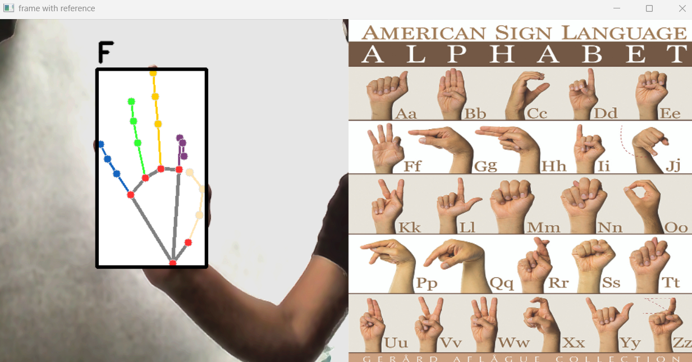
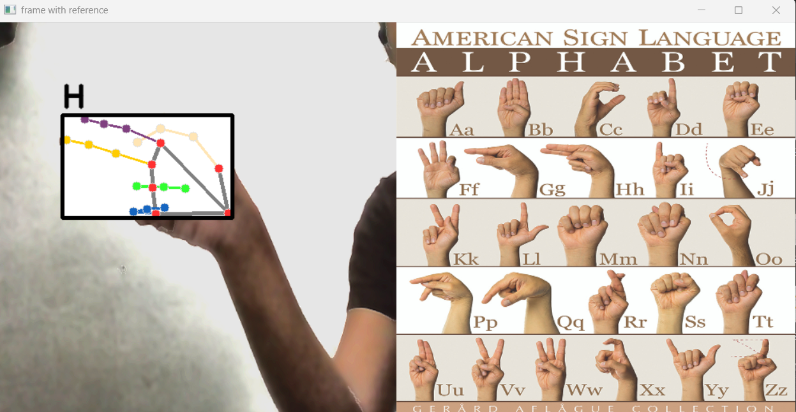
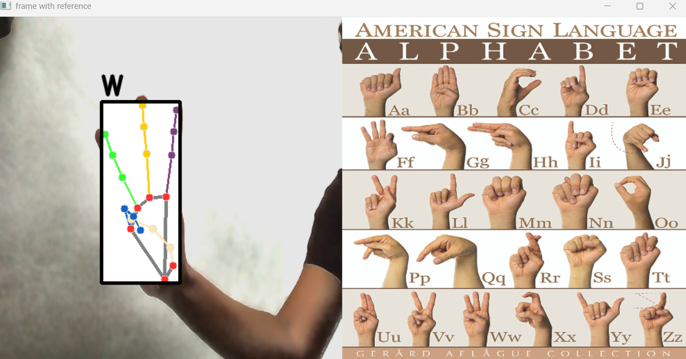
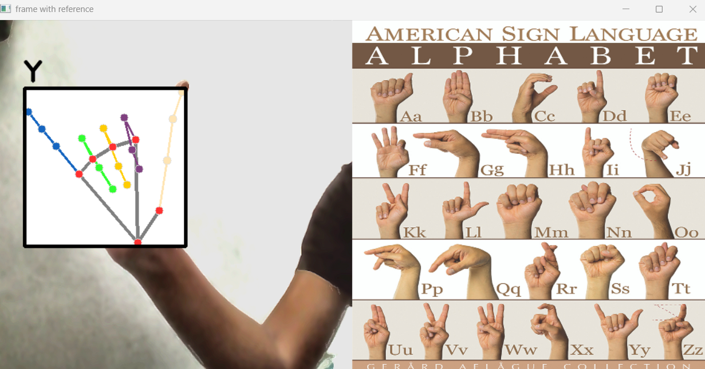

# Indian Sign Language Recognition using Digital Image Processing

A real-time Indian Sign Language (ISL) recognition system built with **Python**, **Digital Image Processing**, **MediaPipe**, and **Machine Learning**. The application detects hand landmarks from a webcam and predicts the corresponding ISL alphabet in real time.

---

## Features

- Real-time ISL alphabet recognition
- Hand landmark detection using MediaPipe
- Random Forest based gesture classification
- Image preprocessing for improved detection accuracy
- Side-by-side ISL reference image
- Complete dataset creation and training pipeline

---

## Sample Output

### Letter F



### Letter H



### Letter W



### Letter Y



---

# Getting Started

## Clone the repository

```bash
git clone https://github.com/ShruthilayaAV/sign-language-detector.git
cd sign-language-detector
```

## Install dependencies

```bash
pip install -r requirements.txt
```

---

# Running the Project

### If you already have `data.pickle`

Train the classifier:

```bash
python train_classifier.py
```

This generates:

```
model.p
```

Start real-time prediction:

```bash
python inference_classifier.py
```

The webcam will open and display:

- Live camera feed
- Hand landmarks
- Predicted ISL alphabet
- Reference ISL image

To stop the application:

```
Ctrl + C
```

---

## Training Your Own Dataset

Want to train your own model?

### Step 1 — Capture Images

```bash
python collect_images.py
```

### Step 2 — Create the Dataset

```bash
python create_dataset.py
```

This generates:

```
data.pickle
```

### Step 3 — Train the Model

```bash
python train_classifier.py
```

This generates:

```
model.p
```

### Step 4 — Start Prediction

```bash
python inference_classifier.py
```

---

## How It Works

1. Captures frames from the webcam.
2. Applies image preprocessing techniques to improve image quality.
3. Detects hand landmarks using MediaPipe.
4. Extracts landmark features.
5. Uses a trained Random Forest classifier to predict the ISL alphabet.
6. Displays the prediction alongside an ISL reference image.

---

## Technologies

- Python
- Digital Image Processing (DIP)
- OpenCV
- MediaPipe
- NumPy
- Scikit-learn
- Pickle

---

## Image Processing Techniques

The recognition pipeline applies multiple enhancement techniques, including:

- Histogram Equalization
- CLAHE
- Gaussian Blur
- Median Blur
- Bilateral Filtering
- Brightness & Contrast Enhancement
- Gamma Correction
- Sharpening
- Edge Enhancement

---

## Future Improvements

- Word-level sign recognition
- Sentence formation
- Deep learning-based classification
- Dynamic gesture recognition
- Speech synthesis
- Web application deployment

---

## Author

**Shruthilaya A V**
